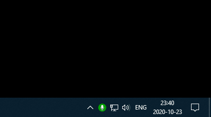

# Hush

Hush is a Windows application that mutes and unmutes the primary microphone.

# License

Copyright © Patrik Svensson

Hush is provided as-is under the MIT license. For more information see LICENSE.

* For NAudio, see https://github.com/naudio/NAudio/blob/master/license.txt
  and https://github.com/naudio/NAudio/issues/246#issuecomment-335190789
